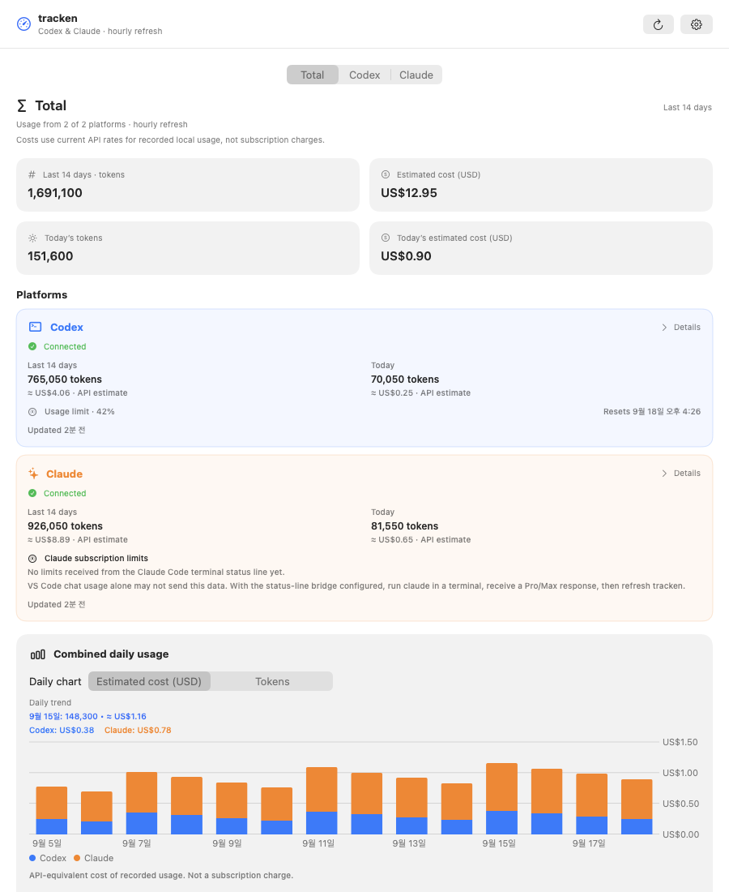
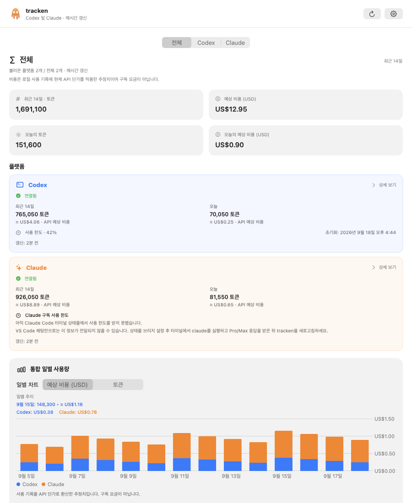
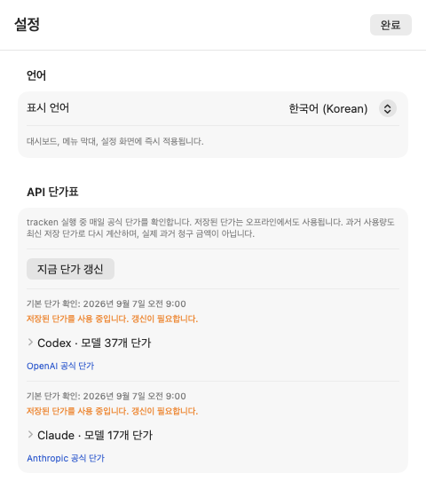
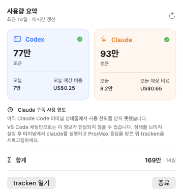

# tracken

[한국어](README.md) · **English**

A macOS app for viewing Codex and Claude Code token usage, estimated API-equivalent costs, and subscription limits in one place. It provides a main dashboard and a menu bar popover, with hourly refreshes while the app is running—even when its main window is closed.

tracken is an **independently developed app**, not a built-in Claude or Codex feature. It reads data through the local Codex App Server, Claude Code session files, and Claude Code's official status-line feature.

> [!IMPORTANT]
> Token history, subscription limits, and estimated costs are separate measures. Limit percentages describe account subscription quotas, not a project's share of tokens. Costs are reference estimates based on current standard API prices, not subscription fees or actual bills.

## Contents

- [Features](#features)
- [Screenshots](#screenshots)
- [Requirements](#requirements)
- [Clone, build, and install locally](#clone-build-and-install-locally)
- [First launch and connections](#first-launch-and-connections)
- [Using the dashboard and menu bar](#using-the-dashboard-and-menu-bar)
- [Subscription limits and the Claude status line](#subscription-limits-and-the-claude-status-line)
- [Cost estimates and pricing updates](#cost-estimates-and-pricing-updates)
- [Automatic and manual refresh](#automatic-and-manual-refresh)
- [Data locations and coverage](#data-locations-and-coverage)
- [Troubleshooting](#troubleshooting)
- [Development and verification](#development-and-verification)

## Features

| Feature | What it provides |
| --- | --- |
| Total dashboard | Combined tokens and estimated costs for today and the last 14 days, provider status, and stacked daily charts |
| Codex details | Daily tokens for the last 14 days, local per-model usage and cost estimates, account plan, and usage limit |
| Claude details | Last 14 days, last 30 days, or all local history; input, output, and cache tokens; daily and per-model cost estimates |
| Menu bar | Each provider's 14-day tokens, today's tokens and estimated cost, combined tokens, and Codex/Claude subscription limits |
| Limit display | Used percentages and reset times. The Codex menu supports both primary and secondary windows, including responses with only one window |
| Pricing management | Automatic official standard API price updates, manual updates per provider, disk caches, and bundled offline prices |
| Charts and lists | Switch between tokens and estimated cost, inspect dates on hover, and distinguish partial cost estimates |
| Korean and English | Immediate language changes across the dashboard, menu, and settings; saved across launches |
| Connection management | Reuse the Codex CLI login, read Claude local history automatically, and remove legacy Anthropic API keys |

## Screenshots

These screenshots use sample data rather than real account information. Some images predate the latest limit-display additions.



<details>
<summary>Korean dashboard and language settings</summary>





</details>



## Requirements

| Purpose | Requirement |
| --- | --- |
| Run the app | macOS 26.3 or later |
| Build from source | Git and a full Xcode installation. Currently verified with Xcode 26.6; Swift language mode is 5 |
| Codex usage | Local Codex CLI with a ChatGPT login. Account data requires a network connection |
| Claude token history | Claude Code session files saved on this Mac. No API key entry required |
| Claude subscription limits | Python 3, Claude Code 2.1.251 or later with `rate_limits` status-line data, and a response in a Pro/Max session |
| Official pricing updates | Internet access. Saved and bundled prices remain usable offline |
| Regression tests | Xcode tools and Python 3 |

The deployment target follows `MACOSX_DEPLOYMENT_TARGET` in the [Xcode project](tracken.xcodeproj/project.pbxproj). If you only have Xcode Command Line Tools, install the full Xcode app and complete its first-launch setup. Providers work independently; using only one is supported.

## Clone, build, and install locally

### 1. Clone the repository

In Terminal, navigate to your preferred workspace and run:

```bash
git clone https://github.com/jaynamm/tracken.git
cd tracken
```

Unless stated otherwise, run the following commands from the repository root. There is no separate npm or Python package installation step.

### 2. Build and run in Xcode

```bash
open tracken.xcodeproj
```

1. Select the **tracken** scheme in Xcode.
2. Select **My Mac** as the run destination.
3. Press `⌘R` to build and run.
4. Look for the main window and the tracken icon in the macOS menu bar.

Development builds and the installed app share a bundle identifier. Launching a new instance terminates the previous tracken instance to prevent duplicate menu icons.

### 3. Build a Release app from Terminal

If Xcode is installed at `/Applications/Xcode.app`, use the following command. Adjust `DEVELOPER_DIR` if your Xcode installation is elsewhere.

```bash
DEVELOPER_DIR=/Applications/Xcode.app/Contents/Developer \
  xcodebuild \
  -project tracken.xcodeproj \
  -scheme tracken \
  -configuration Release \
  -derivedDataPath DerivedData \
  CODE_SIGN_IDENTITY=- \
  CODE_SIGN_STYLE=Manual \
  DEVELOPMENT_TEAM= \
  build
```

A successful build ends with `BUILD SUCCEEDED` and produces:

```text
DerivedData/Build/Products/Release/tracken.app
```

This command uses ad-hoc signing for local use. It does not submit an App Store build or perform Developer ID notarization.

You can run the build before installing it:

```bash
open DerivedData/Build/Products/Release/tracken.app
```

### 4. Install in Applications

1. Select **Quit** from tracken's menu bar popover if it is running.
2. Open the build output folder with the command below.
3. In Finder, copy `tracken.app` to **Applications (`/Applications`)**, replacing the existing app if present.
4. Launch tracken from Applications.

```bash
open DerivedData/Build/Products/Release
```

Once installed, the app runs without Xcode open. Installing the app and installing the Claude status-line script are separate steps. To display Claude subscription limits, also complete the [status-line setup](#install-the-claude-status-line-bridge) below once.

### 5. Update an existing installation

From the repository folder, get the latest source:

```bash
git pull --ff-only
```

If local changes or a diverged branch prevent this command from succeeding, inspect your Git state while preserving your changes. After updating the source, repeat **Release build → quit the app → replace the app in `/Applications` → launch**.

App data lives outside the app bundle, so replacing only the app preserves pricing caches and Claude limit files. If an update changes the status-line script itself, run its installer again. Reinstallation preserves the original status-line restoration information.

```bash
python3 Scripts/install-claude-statusline.py
```

## First launch and connections

### Connect Codex

1. Ensure that the local Codex CLI is installed and can sign in with your ChatGPT account.
2. Launch tracken. If the CLI is already signed in, the app attempts to read usage at startup.
3. If a connection is needed, open Settings with the main window's gear button or `⌘,`, then choose **Codex → Connect with ChatGPT**.
4. Complete browser sign-in if prompted, then return to tracken.
5. Use **Sync now** to refresh only Codex data.

tracken searches for the executable at `/opt/homebrew/bin/codex`, `/usr/local/bin/codex`, and then in the app process's `PATH`. A CLI available in your terminal may not be available in the environment inherited by an app launched from Finder.

**Sign out** logs out the **shared Codex CLI account**, not just tracken. The app displays a confirmation dialog. After logout, Codex data is also removed from tracken.

### Load Claude local history

Claude history loads automatically from `~/.claude/projects/**/*.jsonl` by default. No separate connection button or API key is needed.

1. Use Claude Code on this Mac to create local session history.
2. Open tracken's **Claude** page.
3. Select **Last 14 days**, **Last 30 days**, or **All local history**.
4. To read it again immediately, choose **Settings → Claude → Reload history**.

Conversations used in VS Code can contribute tokens when saved in the same local history location. However, **having local token history does not mean subscription limits have been received**. Limits use the separate status-line bridge.

**Remove old API key** removes only a key stored by an older tracken version in macOS Keychain. Current history reading does not need it. This action does not delete Claude session history or a subscription account.

### Choose a display language

Open **Settings → Language** and select **한국어 (Korean)** or **English**. The dashboard, menu bar, settings, and date/number formatting update immediately, and the selection persists across launches. On first launch, the app uses Korean when it is the preferred macOS language and English otherwise. Model names and some external error messages remain unchanged.

## Using the dashboard and menu bar

### Time ranges

| View | Coverage |
| --- | --- |
| Total | Last 14 days, including today |
| Codex details | Last 14 days, including today |
| Claude details | Last 14 days, last 30 days, or all local history still present on this Mac |
| Menu bar token totals | Always the last 14 days, independent of the Claude detail-page selection |
| Subscription limits | Windows supplied by the server or status line, independent of the dashboard range |

Daily aggregation uses the Mac's current calendar and time zone. The 14-day and 30-day views fill dates without recorded usage with zero. **All local history** covers the remaining local files; it does not recover deleted history.

### Total dashboard

The default page shows tokens and estimated costs for the last 14 days and for today. **Platforms** cards show connection status, today's and 14-day usage, limits, and update times. Use **Details** or the top tabs to open a provider page.

Only providers with loaded data are included in the total, and the app shows how many are included. If an ordinary refresh failure leaves previous data available, the total includes it with a notice. With no data, values display as `—`. Subscription limit percentages are never added across providers.

### Daily charts and lists

- Switch the chart between **Estimated cost (USD)** and **Tokens**.
- Total charts use blue for Codex and orange for Claude in stacked bars.
- Hover over a date to inspect tokens, costs, and provider breakdowns in the fixed detail area above the chart. Moving away restores the default date information.
- Daily lists show each date's total. Total also includes provider rows below each date.
- Partially priced usage is marked as a partial estimate and uses lighter cost bars. Entirely unpriced records are excluded from cost bars but remain in token totals.

Provider pages also show per-model tokens and estimated costs. Claude includes input/output and cache breakdowns. Codex account daily totals and local per-model totals may differ because they cover different sources.

### Menu bar popover

Click the tracken icon in the macOS menu bar. The menu bar itself displays an icon; the numerical values appear inside the popover:

- Each provider's 14-day tokens, today's tokens and estimated cost, and connection status
- Codex primary/secondary limits and Claude 5-hour/7-day limits
- Combined 14-day tokens when at least one provider is connected
- Full usage refresh, **Open tracken**, and **Quit**

Closing the main window keeps the menu bar app and automatic refresh running. Use **Quit** to stop the app completely.

## Subscription limits and the Claude status line

### Reading limit values

`52%` means **52% of that window's limit has been used**. It is not the remaining percentage or a project's share, and tracken does not infer it from token counts.

| Display | Meaning |
| --- | --- |
| Percentage and progress bar | Received usage percentage for that limit window |
| Resets | Scheduled reset time for the window |
| Not reported or `—` | A limit value was not provided; it is not treated as 0% |
| Window ended; awaiting update | The reset time has passed and a new value is needed; it is not automatically changed to 0% |

### Codex limits

Limits come from `account/rateLimits/read` in the [Codex App Server](https://learn.chatgpt.com/docs/app-server). The app prefers `rateLimitsByLimitId.codex` and falls back to the legacy `rateLimits` response.

The menu popover retains and displays both `primary` and `secondary` windows. Labels follow the window durations returned by the server, so **two fixed 5-hour and 7-day windows are not guaranteed**. An account returning only a weekly limit shows only that window. If no windows are supplied, the app shows Not reported.

The Total card and Codex detail summary currently use `primary`. Use the menu popover to inspect both windows' individual progress bars and expiration states.

### Install the Claude status-line bridge

Claude token history and limits follow separate paths:

```text
Claude Code local session JSONL ─────────────────→ Tokens and estimated costs
Claude Code terminal statusLine → tracken script → Limit cache → 5-hour/7-day limits
```

The [official Claude Code status-line documentation](https://code.claude.com/docs/en/statusline#rate-limit-usage) requires a supported version and the first response in a Pro/Max session for subscription windows. tracken uses `five_hour` and `seven_day`; it does not display gateway `spend_limit` values.

Install from the repository root:

```bash
python3 Scripts/install-claude-statusline.py
```

The installer:

1. Backs up an existing Claude settings file as `settings-before-date-time.json`.
2. Installs the executable script and `bridge-config.json` under `~/Library/Application Support/tracken/Claude/`.
3. Connects the Claude user setting `statusLine` to the bridge, retaining an existing command as `previousStatusLine`.

After installation, run `claude` in a regular terminal or VS Code's integrated terminal, receive a response, and refresh tracken. Using only the Claude chat panel in VS Code may not deliver status-line data.

Without a previous status-line command, the terminal footer looks like this. These numbers are examples:

```text
tracken | 5h: 52% | 7d: 27%
```

Before data arrives, it displays `tracken | waiting for Claude limits`. With an existing command, the bridge saves limits and forwards the original input to that command, preserving its output.

By default, this is a Claude user-level setting shared across projects. You do not need to attach the tracken repository to a Claude session. It works while you work in other projects. Multiple Claude accounts are not stored separately; the shared cache retains the most recent valid snapshot written to it.

### Restore the previous status line or use a custom config directory

From the repository root, restore the previous status line with:

```bash
python3 Scripts/install-claude-statusline.py --uninstall
```

The installer restores the previous command, or removes tracken's `statusLine` setting if none existed. If you changed to another status line after installation, it leaves that setting untouched. This command does not delete the app or session history; bridge files and backups also remain.

If you use a config directory other than `~/.claude`, specify it when installing:

```bash
python3 Scripts/install-claude-statusline.py --config-dir "$HOME/.claude-work"
```

Claude Code and tracken must use the same configuration path. tracken reads `CLAUDE_CONFIG_DIR` at launch. Finder-launched apps may not inherit your shell configuration, so you can launch the installed executable with the required environment:

```bash
env CLAUDE_CONFIG_DIR="$HOME/.claude-work" \
  /Applications/tracken.app/Contents/MacOS/tracken
```

To uninstall from that configuration, combine `--config-dir` with `--uninstall`. The installer also exposes `--bridge-dir`, but **the app reads limits from the fixed default bridge folder**. Leave that option unchanged for a normal installation.

## Cost estimates and pricing updates

### Calculation rules

Costs are USD estimates that apply **the currently saved standard API rates** to the model and tokens recorded in each session. Today's value is recorded usage so far, not an end-of-day forecast.

- Codex prioritizes account daily token totals and fills dates absent from the server using local records. Costs and per-model details come from the last 14 days of sessions on this Mac. Lifetime token increases are not arbitrarily assigned to today.
- Claude uses ordinary input, cache reads, cache creation, and output. Displayed input totals include cache tokens, while costs apply the separate rate for each category. Cache writes distinguish 5-minute and 1-hour durations.
- Codex applies long-context prices above 272K input tokens when the table provides them. It does not reproduce actual Fast or Batch billing rates.
- Unsupported Claude pricing modes, unknown models, and some older models' requests above 200K input tokens remain unpriced. Records with US inference geography (`inference_geo=us`) use the implemented 1.1× multiplier.
- Tool fees, taxes, subscriptions, and negotiated contracts are excluded. Past dates are recalculated when prices change and may differ from historical bills.

| Cost display | Interpretation |
| --- | --- |
| `$0.00` | No usage in the loaded records, or a calculated zero cost |
| `< $0.01` | A known positive cost below one cent |
| Partial estimate | Only the priced subset of records is included; full cost is unknown |
| `—` / Cost estimate unavailable | Required model details, rates, or other pricing information are missing |
| Rate unavailable | No applicable price for the model or request conditions |
| Details unavailable | An older record has a token total but insufficient model or input/output details |

### Inspect and refresh official prices

1. Open **Settings → Codex or Claude → API price tables**.
2. Check the last verification time, whether bundled rates are in use, and any download error.
3. Expand the model list to inspect input, output, cache-read, and cache-write rates in **USD per million tokens**.
4. Click **Update prices now** to refresh only that provider. If prices changed, its usage costs are recalculated as well.

Sources are the [official OpenAI price table](https://developers.openai.com/api/docs/pricing.md) and [official Anthropic price table](https://platform.claude.com/docs/en/about-claude/pricing). The parser validates standard text-token tables and excludes separate Fast and Batch tables. New models are picked up when added in the supported table format. Dated model snapshots can inherit a base model's rate; arbitrary new suffixes do not receive a guessed price.

Claude numeric footnotes such as `MTok1` and `MTok<sup>1</sup>` are supported. Bundled rates were verified on **2026-09-07 for OpenAI** and **2026-09-29 for Claude**. The bundled Claude table contains **19 models, including Opus 5.5 and Sonnet 5.5**. These describe the bundled snapshot; online rates and model counts may change later.

If downloading, validation, or saving fails, the app retains the previous prices and verification time and displays an error. If no valid disk cache exists, it uses bundled prices.

## Automatic and manual refresh

| Action | Usage and limits | Prices |
| --- | --- | --- |
| App launch | Read Codex/Claude usage and the Claude limit cache | Download if refresh conditions are met |
| Hourly while running | Read all usage and limits again | Check when 24 hours have elapsed since the last successful verification |
| Main-window or menu refresh | Read all usage and limits again | Does not force a price update |
| Codex Sync now | Read only Codex usage and limits | Does not force a price update |
| Claude Reload history | Read Claude history and the limit cache | Does not force a price update |
| Provider Update prices now | Recalculate that provider if rates changed | Check the selected provider immediately |
| Open a window/menu or change a session file | Does not trigger a read by itself | Does not trigger a check by itself |

Automatic retries after a pricing failure are at least one hour apart. Conditional requests use ETag or Last-Modified when available. Overlapping usage refreshes for the same provider are deduplicated.

A new Claude status-line cache appears in tracken at the next hourly or manual refresh. Limit views periodically reevaluate expiration for display, but this does not fetch the server or reread the file. The Claude limit update timestamp records when the bridge received data; it is not guaranteed to be the provider server's measurement time.

## Data locations and coverage

### Source, installed app, and data folder

| Location | Role |
| --- | --- |
| Your clone, for example `~/workspace/tracken` | Xcode project, Swift source, installer scripts, and tests |
| `/Applications/tracken.app` | The built and installed application |
| `~/Library/Application Support/tracken/` | The same app's pricing cache, Claude limit cache, and bridge files |

These are not separate tracken services. The `tracken` label in Claude's status line is printed by the bridge from this repository. Replacing the app does not automatically update an already-installed status-line script.

### Files read or written

| Path | Purpose |
| --- | --- |
| `~/.codex/sessions/**/*.jsonl` | Local Codex model/token history; uses `sessions` under `CODEX_HOME` when set |
| `~/.claude/projects/**/*.jsonl` | Claude Code history; uses `projects` under `CLAUDE_CONFIG_DIR` when set |
| `~/.claude/settings.json` | The installer manages the `statusLine` setting here |
| `~/Library/Application Support/tracken/Claude/claude-statusline.py` | Installed status-line bridge |
| `bridge-config.json` in that folder | Previous and installed status-line commands |
| `rate-limits.json` in that folder | 5-hour/7-day limits and receipt/value-change timestamps |
| `settings-before-*.json` in that folder | Claude settings backups made before installation or removal |
| `~/Library/Application Support/tracken/Pricing/codex.json` | Validated OpenAI pricing cache |
| `~/Library/Application Support/tracken/Pricing/anthropic.json` | Validated Claude pricing cache |

There is no GUI folder picker for source history. Apply environment variables when launching the app.

### Coverage and privacy

- Claude tokens cover local files still present on this Mac. The app does not retrieve Claude web usage, history stored only on other devices, or deleted sessions through an account API.
- Codex daily tokens and limits follow the logged-in account response; model-level costs cover local records.
- Duplicate response records are removed. Claude streaming updates contribute their final output count once. Resumed Codex sessions are grouped by token-event dates rather than conversation creation dates.
- Aggregators decode required metadata such as dates, models, tokens, and IDs used for deduplication. They do not send local conversation contents externally or create new model requests to retrieve history.
- The CLI manages Codex authentication. Claude history and the bridge require no API key. If a previous status-line command exists, forwarding the original JSON to it remains part of the bridge behavior.
- The bridge's limit cache stores no prompts, project paths, session IDs, or credentials. Settings backups are copies of the original settings file and are separate from the limit cache.
- tracken does not replicate usage history into a separate persistent database. Pricing and limit caches remain on disk; provider token history is reread from its original source.

There is currently no project-by-project or multi-account dashboard, CSV export, automatic quota reset, app binary auto-updater, or UI for enabling launch at login.

## Troubleshooting

| Symptom | What to check |
| --- | --- |
| Xcode cannot be found during build | Install the full Xcode app, complete first-launch setup, and confirm that `DEVELOPER_DIR` points to it. |
| Codex CLI not found | Check `command -v codex`. It must be executable at a supported default location or through the app process's `PATH`. |
| Codex needs login or cannot fetch usage | Check the CLI's ChatGPT login and network connection, then connect or sync again in Settings. |
| Only a weekly Codex limit appears | The server may provide only one window. tracken does not invent a 5-hour limit. |
| Claude tokens appear but limits do not | These use separate paths. Install the bridge, receive a Pro/Max response in terminal `claude`, then refresh tracken. |
| VS Code Claude chat has no limit updates | The chat panel may not run the terminal status line. Try `claude` in VS Code's integrated terminal. |
| No Claude local history | Check the `projects` JSONL files and read permissions. For a custom config directory, pass `CLAUDE_CONFIG_DIR` to the app as well. |
| Today is zero but older usage exists | This can be correct. Past records are not moved into today. Select a wider Claude history range. |
| Window ended; awaiting update | A new sample is required. Refetch Codex, or obtain a Claude terminal response to update its cache before refreshing tracken. |
| Model prices remain old after refresh | Normal usage refresh does not force a price download. Use the provider's **Update prices now** button. |
| Pricing error or an unlisted model | Saved prices are retained. Update the app and retry the official price download; unsupported formats/models remain unpriced. |
| Tokens exist but cost is partial or `—` | Some records may lack model details, input/output counts, or rates. Only known costs are shown. |
| The app keeps running after closing its window | This is normal menu bar behavior. Use **Quit** to stop it. |
| Restore the original Claude status line | Run the installer with `--uninstall`, including the same config-directory option if you used one. |

## Development and verification

### Project structure

```text
tracken/
├── README.md                    # Korean guide
├── README.en.md                 # English guide
├── tracken.xcodeproj/           # Xcode project
├── Configuration/              # Info.plist and build configuration
├── Scripts/                    # Status-line installation/runtime, tests, icon generator
├── Tests/                      # Usage, pricing, limit, and localization regressions; official pricing fixture
├── docs/images/                # Sample documentation screenshots
└── tracken/
    ├── App/                    # App entry point and single-instance management
    ├── Features/
    │   ├── Dashboard/          # Total/provider pages, charts, and lists
    │   ├── MenuBar/            # Popover and Codex limit display
    │   └── Settings/           # Connections, history, language, and prices
    ├── Models/                 # Usage, cost, and limit models
    ├── Services/               # App Server, local history, prices, limit cache, Keychain
    ├── Stores/                 # Shared state and refresh coordination
    ├── Utilities/              # Formatting, localization, and chart selection
    └── Resources/              # Icons, colors, and Korean/English strings
```

The app uses SwiftUI, Swift Charts, Observation, Swift Concurrency, Foundation, and AppKit. Security/Keychain Services supports legacy API key management.

### Regression tests

Run from the repository root. Tests use temporary files and response fixtures without real accounts or API keys.

```bash
./Scripts/test-usage.sh
```

Coverage includes calendar/time-zone aggregation, deduplication, resumed sessions, partial costs, both Codex windows and weekly-only responses, Claude bridge installation/restoration, hourly scheduling, pricing caches and offline fallback, repricing, official Claude HTML footnotes and 19 models, and Korean/English strings.

The earlier build command also verifies a local Release build. `DerivedData/` is excluded from Git.

### Update icons

The Dock/Finder app icon is generated from vector shapes in the [icon generator](Scripts/generate-app-icon.swift). After editing it, regenerate assets with the following command. The menu bar uses a separate monochrome asset.

```bash
swift Scripts/generate-app-icon.swift
```

### Official references

- [Codex App Server](https://learn.chatgpt.com/docs/app-server)
- [OpenAI standard API pricing](https://developers.openai.com/api/docs/pricing.md)
- [Claude Code status line and limit data](https://code.claude.com/docs/en/statusline#rate-limit-usage)
- [Claude standard API pricing](https://platform.claude.com/docs/en/about-claude/pricing)
