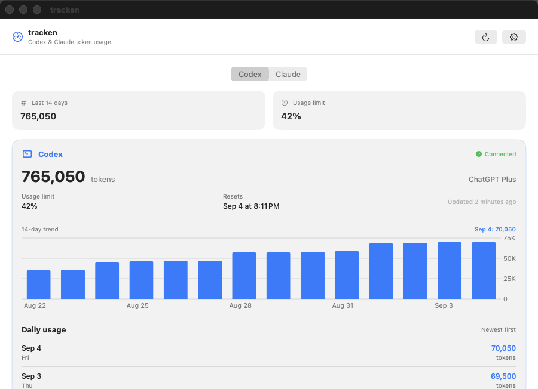
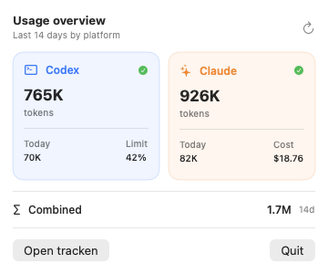

# tracken

Codex와 Anthropic의 토큰 사용량을 한곳에서 확인하는 macOS 메뉴 막대 앱입니다. 메인 대시보드와 메뉴 막대 팝오버에서 최근 14일 사용량과 공급자별 사용 현황을 확인할 수 있습니다.

> [!IMPORTANT]
> Codex 사용량은 로컬 Codex CLI에 로그인된 ChatGPT 계정에서 가져옵니다. Anthropic 연동은 아직 프로토타입이며, API 키를 기반으로 생성한 모의 데이터를 표시합니다.

## 실행 화면

계정 정보를 노출하지 않도록 문서용 샘플 데이터를 사용했습니다.

### 메인 대시보드



### 메뉴 막대



## 주요 기능

- Codex(ChatGPT)와 Claude(Anthropic) 공급자 전환
- 최근 14일간의 일별 토큰 차트 및 상세 목록
- Codex 사용 한도·초기화 시각과 Anthropic 입력·출력 토큰·예상 비용 요약
- 메뉴 막대에서 공급자별 사용량 빠르게 확인
- 전체 또는 공급자별 사용량 새로고침
- Codex CLI의 기존 ChatGPT 로그인 재사용
- Anthropic API 키를 평문 설정 파일이 아닌 macOS 키체인에 저장
- 연결 해제 시 계정 세션 또는 저장된 키와 해당 공급자의 사용량 제거

## 요구 사항

- macOS 26.3 이상
- Swift 5
- 프로젝트를 빌드할 수 있는 Xcode
- Codex 사용량 연동 시 로컬 Codex CLI

배포 대상 버전은 Xcode 프로젝트의 `MACOSX_DEPLOYMENT_TARGET` 설정을 따릅니다.

## 시작하기

1. 저장소를 클론합니다.

   ```bash
   git clone https://github.com/jaynamm/tracken.git
   cd tracken
   ```

2. `tracken.xcodeproj`를 Xcode에서 엽니다.

   ```bash
   open tracken.xcodeproj
   ```

3. `tracken` 스킴과 실행할 Mac을 선택한 뒤 `⌘R`로 앱을 실행합니다.

앱은 메인 창과 메뉴 막대 항목을 함께 제공합니다. Dock에는 별도의 앱 아이콘을 유지하지 않습니다.

## 사용 방법

1. 메인 화면의 톱니바퀴 버튼을 누르거나 macOS 설정 단축키 `⌘,`로 설정을 엽니다.
2. Codex는 **Connect with ChatGPT**를 눌러 로컬 Codex CLI 계정을 연결합니다. Anthropic은 API 키를 입력하고 **Connect**를 누릅니다.
3. 대시보드에서 공급자를 선택해 최근 14일 사용량을 확인합니다.
4. 새로고침 버튼으로 연결된 공급자의 데이터를 다시 불러옵니다.
5. 연결을 해제하려면 설정에서 Codex의 **Sign out** 또는 Anthropic의 **Disconnect**를 누릅니다.

Anthropic은 현재 8자 이상의 문자열이면 프로토타입용 키로 사용할 수 있으며, 실제 공급자 인증은 수행하지 않습니다.

## 프로젝트 구조

```text
├── Configuration/               # Info.plist 등 빌드 구성
└── tracken/
    ├── App/                     # 앱 진입점과 단일 인스턴스 관리
    ├── Features/
    │   ├── Dashboard/           # 화면, 사용량 카드, 일별 차트
    │   ├── MenuBar/             # 메뉴 막대 팝오버
    │   └── Settings/            # Codex/API 키 연결 화면
    ├── Models/                  # UI와 독립적인 도메인 모델
    ├── Services/                # App Server, 사용량, 키체인 접근
    ├── Stores/                  # 앱 상태 및 새로고침 조정
    ├── Utilities/               # 표시 형식과 UI 표현 속성
    └── Resources/               # 앱 색상과 아이콘 에셋
```

## 기술 구성

- SwiftUI: 메인 창, 설정 창, 메뉴 막대 UI
- Swift Charts: 최근 14일 토큰 사용량 시각화
- Observation: 공유 사용량 및 연결 상태 관리
- Security/Keychain Services: 공급자 API 키 저장
- Swift Concurrency: 공급자별 비동기 새로고침

## 공급자 연동 상태

Codex는 `CodexAppServerTransport.swift`가 `codex app-server` JSONL 통신을 담당하고, `CodexAppServerClient.swift`가 응답을 앱 모델로 변환합니다. 로컬 CLI의 로그인 계정, 일별 사용량, 사용 한도를 읽으며 ChatGPT 인증 정보는 앱에서 직접 취급하지 않습니다.

Anthropic의 실제 사용량을 가져오려면 `tracken/Services/UsageService.swift`의 `DemoAnthropicUsageService`를 실제 `AnthropicUsageProviding` 구현으로 교체해야 합니다.

현재 파일에는 Anthropic 사용량 API를 호출하기 위한 요청 형태가 주석으로 정리되어 있습니다. 구현할 때는 다음 사항도 함께 처리해야 합니다.

- HTTP 상태 코드와 공급자 오류 응답
- 페이지네이션 및 조회 기간
- 공급자 응답을 `TokenUsage`와 `DailyUsage`로 집계
- 요금제와 모델별 단가를 반영한 비용 계산
- 네트워크 실패 및 요청 제한에 대한 사용자 안내

Anthropic 사용량 API에는 일반 API 키가 아닌 Admin API 키가 필요할 수 있습니다.

## 보안 참고 사항

Codex의 OAuth 인증 정보는 로컬 Codex CLI가 관리하며 앱으로 전달되지 않습니다. Anthropic API 키는 서비스 식별자 `com.tracken.apikeys`로 macOS 키체인에 저장되고 연결을 해제할 때 삭제됩니다. 현재 Anthropic 모의 구현은 키를 외부 서버로 전송하지 않지만, 실제 API 연동 시에는 공식 HTTPS 엔드포인트 외의 대상으로 키가 전달되지 않도록 주의해야 합니다.
