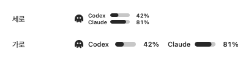
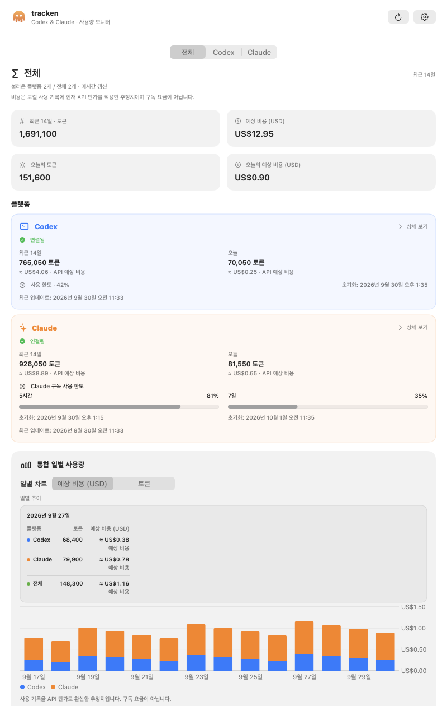
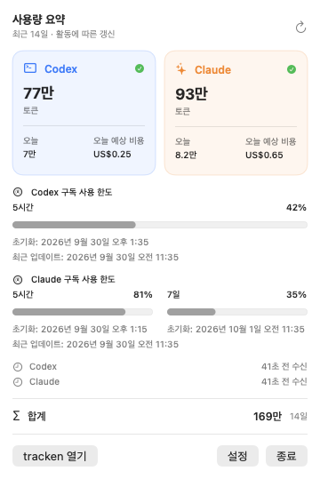
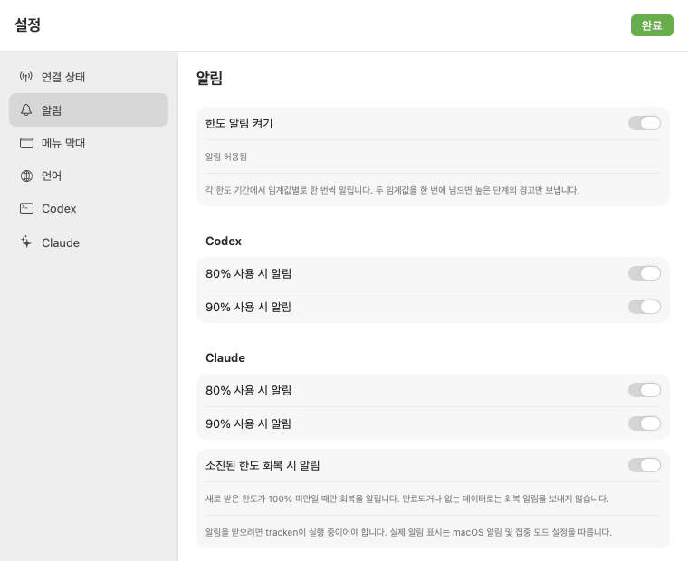
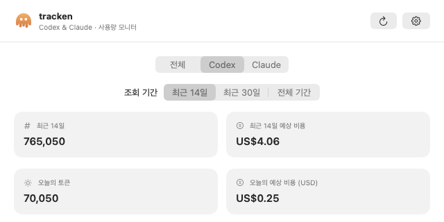
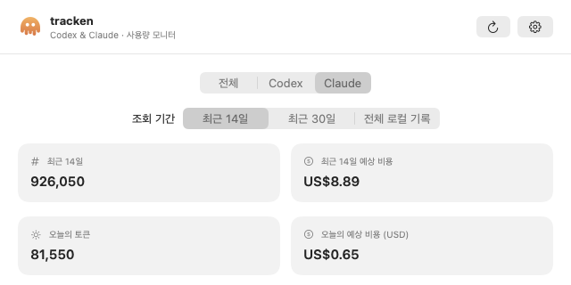
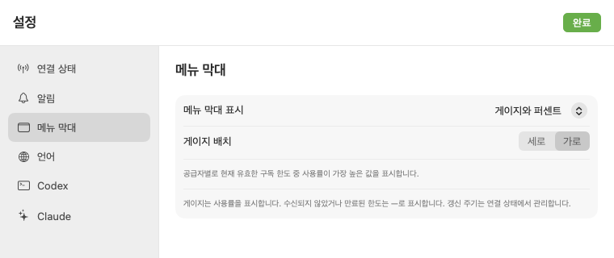

# tracken

**한국어** · [English](README.en.md)

Codex와 Claude Code의 토큰 사용량, API 환산 예상 비용, 구독 사용 한도를 한곳에서 확인하는 macOS 앱입니다. 메인 대시보드와 메뉴 막대 팝오버를 제공하며, 창을 닫아도 앱이 실행 중이면 활동 여부에 맞춰 사용량과 한도를 갱신합니다.

tracken은 **독립적으로 개발한 앱**입니다. Claude나 Codex의 기본 내장 기능이 아닙니다. Codex의 로컬 App Server와 Claude Code의 로컬 기록·공식 상태줄 기능을 이용해 데이터를 읽습니다.

> [!IMPORTANT]
> 토큰 기록, 구독 사용 한도, 예상 비용은 서로 다른 지표입니다. 한도 사용률은 계정의 구독 한도이며 프로젝트별 토큰 비율이 아닙니다. 예상 비용은 기록된 사용량을 현재 표준 API 단가로 환산한 참고값으로, 구독료나 실제 청구액이 아닙니다.

## 목차

- [주요 기능](#주요-기능)
- [실행 화면](#실행-화면)
- [요구 사항](#요구-사항)
- [클론부터 로컬 빌드와 설치까지](#클론부터-로컬-빌드와-설치까지)
- [처음 실행하고 연결하기](#처음-실행하고-연결하기)
- [대시보드와 메뉴 막대 사용법](#대시보드와-메뉴-막대-사용법)
- [구독 사용 한도와 Claude 상태줄 설정](#구독-사용-한도와-claude-상태줄-설정)
- [예상 비용과 가격표 갱신](#예상-비용과-가격표-갱신)
- [자동 갱신과 수동 새로고침](#자동-갱신과-수동-새로고침)
- [연결 상태 확인](#연결-상태-확인)
- [한도 경고·회복 알림](#한도-경고회복-알림)
- [데이터 위치와 수집 범위](#데이터-위치와-수집-범위)
- [문제 해결](#문제-해결)
- [개발 및 검증](#개발-및-검증)

## 주요 기능

| 기능 | 제공 내용 |
| --- | --- |
| Total 대시보드 | 오늘·최근 14일의 통합 토큰, 예상 비용, 공급자별 연결 상태와 일별 누적 차트 |
| Codex 상세 | 14일·30일·전체 기간 선택, 과거 기록 자동 채우기와 누적 저장, 일별·모델별 토큰·예상 비용, 계정 플랜과 사용 한도 |
| Claude 상세 | 최근 14일·30일·전체 로컬 기록 선택, 입력·출력·캐시 토큰, 일별·모델별 예상 비용 |
| 기간별 비용 요약 | Codex·Claude 모두 기본 최근 14일 예상 비용 표시. 30일·전체 기간 선택 시 제목과 금액 함께 변경 |
| 메뉴 막대 게이지 | 아이콘만·게이지·게이지와 퍼센트 선택, 세로·가로 배치, 설정 즉시 적용과 저장 |
| 메뉴 막대 팝오버 | 공급자별 최근 14일 토큰, 오늘의 토큰·예상 비용, 합계, Codex·Claude 구독 한도와 수신 상태 |
| 한도 표시 | 사용률·초기화 시각 표시. Codex 메뉴는 단기·주간 한도를 모두 지원하며 한쪽만 반환돼도 표시 |
| 가격표 관리 | 공식 표준 API 가격표 자동 갱신, 공급자별 수동 갱신, 로컬 캐시와 오프라인 기본 가격표 |
| 차트와 상세 목록 | 토큰·예상 비용 전환, 날짜에 마우스를 올려 상세 확인, 부분 추정 비용 구분 |
| 한국어·English | 대시보드·메뉴·설정에 즉시 적용하고 언어 선택 저장 |
| 모니터링·알림 | 활동에 따른 갱신, 공급자별 기록·한도 연결 상태, 선택적으로 켜는 80%·90% 경고와 회복 알림 |
| 연결 관리 | Codex CLI 로그인 재사용, Claude 로컬 기록 자동 읽기, 이전 Anthropic API 키 삭제 |

## 실행 화면

2026년 9월 30일의 UI에 문서용 샘플 데이터를 넣어 렌더링한 화면입니다. 계정, 사용량과 한도는 설명용 예시입니다.





**메뉴 막대 팝오버와 알림 설정**





영어 화면은 [English README](README.en.md#screenshots)에서 확인할 수 있습니다.

## 요구 사항

| 목적 | 필요한 환경 |
| --- | --- |
| 앱 실행 | macOS 26.3 이상 |
| 소스 빌드 | Git, 전체 Xcode 설치. 현재 검증 환경은 Xcode 26.6이며 Swift 언어 모드는 5 |
| Codex 사용량 | 로컬 Codex CLI와 ChatGPT 로그인. 계정 데이터 조회에는 네트워크 연결 필요 |
| Claude 토큰 기록 | 이 Mac에 저장된 Claude Code 세션 파일. API 키 입력 불필요 |
| Claude 구독 한도 | Python 3, `rate_limits` 상태줄 데이터를 제공하는 Claude Code 2.1.251 이상, Pro/Max 세션 응답 |
| 공식 가격표 갱신 | 인터넷 연결. 저장된 가격표와 앱 기본 가격표는 오프라인 사용 가능 |
| 회귀 테스트 | Xcode 도구와 Python 3 |

배포 대상은 [Xcode 프로젝트](tracken.xcodeproj/project.pbxproj)의 `MACOSX_DEPLOYMENT_TARGET` 설정을 따릅니다. Xcode Command Line Tools만 설치한 상태라면 먼저 전체 Xcode를 설치하고 최초 실행 설정을 완료하세요. 공급자는 각각 독립적으로 동작하므로 한쪽만 사용해도 됩니다.

## 클론부터 로컬 빌드와 설치까지

### 1. 저장소 클론

터미널에서 원하는 작업 폴더로 이동한 뒤 실행합니다.

```bash
git clone https://github.com/jaynamm/tracken.git
cd tracken
```

이후 별도 안내가 없는 명령은 저장소 루트에서 실행합니다. 이 프로젝트에는 별도의 npm·Python 패키지 설치 단계가 없습니다.

### 2. Xcode에서 빌드하고 실행

```bash
open tracken.xcodeproj
```

1. Xcode 상단에서 **tracken** 스킴을 선택합니다.
2. 실행 대상을 **My Mac**으로 선택합니다.
3. `⌘R`을 눌러 빌드하고 실행합니다.
4. 메인 창과 macOS 상단 메뉴 막대의 tracken 아이콘을 확인합니다.

Xcode에서 실행한 개발용 앱과 설치된 앱은 같은 번들 식별자를 사용합니다. 새 인스턴스를 실행하면 기존 tracken 인스턴스를 종료해 중복 메뉴 아이콘을 방지합니다.

### 3. 터미널에서 Release 빌드

Xcode가 `/Applications/Xcode.app`에 설치된 경우 다음 명령으로 로컬 실행용 앱을 만듭니다. 다른 위치에 설치했다면 `DEVELOPER_DIR` 경로를 바꾸세요.

```bash
DEVELOPER_DIR=/Applications/Xcode.app/Contents/Developer \
  xcodebuild \
  -project tracken.xcodeproj \
  -scheme tracken \
  -configuration Release \
  -derivedDataPath DerivedData \
  CODE_SIGN_IDENTITY=- \
  CODE_SIGN_STYLE=Manual \
  DEVELOPMENT_TEAM= \
  build
```

성공하면 `BUILD SUCCEEDED`가 표시되고 다음 앱이 생성됩니다.

```text
DerivedData/Build/Products/Release/tracken.app
```

이 명령은 로컬 사용을 위한 ad-hoc 서명을 사용합니다. App Store 배포나 Developer ID 공증을 수행하는 명령은 아닙니다.

설치 전에 빌드 결과를 바로 실행할 수 있습니다.

```bash
open DerivedData/Build/Products/Release/tracken.app
```

### 4. 응용 프로그램 폴더에 설치

1. 실행 중인 tracken의 메뉴 막대에서 **종료 / Quit**를 선택합니다.
2. 아래 명령으로 빌드 결과 폴더를 엽니다.
3. Finder에서 `tracken.app`을 **응용 프로그램(`/Applications`)**으로 복사합니다. 기존 앱이 있으면 새 빌드로 교체합니다.
4. 응용 프로그램 폴더의 tracken을 실행합니다.

```bash
open DerivedData/Build/Products/Release
```

설치 후에는 Xcode를 켜지 않아도 앱을 사용할 수 있습니다. 앱 교체와 Claude 상태줄 스크립트 설치는 별도 작업입니다. Claude 구독 한도까지 표시하려면 아래의 [상태줄 설정](#claude-상태줄-브리지-설치)을 한 번 진행하세요.

### 5. 이후 버전 업데이트

저장소 폴더에서 최신 코드를 받습니다.

```bash
git pull --ff-only
```

로컬 수정이나 브랜치 차이로 이 명령이 실패하면 수정 내용을 보존한 채 먼저 Git 상태를 확인하세요. 최신 코드를 받은 뒤 위의 **Release 빌드 → 앱 종료 → `/Applications`의 앱 교체 → 실행** 절차를 반복합니다.

앱 데이터 폴더는 앱 번들과 분리되어 있으므로 앱만 교체해도 저장된 Codex 사용 기록, 가격표와 Claude 한도 파일은 유지됩니다. 상태줄 스크립트 자체가 변경된 버전으로 갱신할 때에는 다음 명령도 다시 실행합니다. 재설치는 기존 상태줄 복원 정보를 보존합니다.

```bash
python3 Scripts/install-claude-statusline.py
```

## 처음 실행하고 연결하기

### Codex 연결

1. 로컬 Codex CLI가 설치되어 있고 ChatGPT 계정으로 로그인할 수 있는지 확인합니다.
2. tracken을 실행합니다. 기존 CLI 로그인이 있으면 시작 시 사용량을 자동으로 읽습니다.
3. 연결이 필요하면 메인 창의 톱니바퀴 또는 `⌘,`로 설정을 열고 **Codex → ChatGPT로 연결 / Connect with ChatGPT**를 선택합니다.
4. 브라우저 로그인이 열리면 완료하고 tracken으로 돌아옵니다.
5. **지금 동기화 / Sync now**로 Codex 데이터만 다시 불러올 수 있습니다.

tracken은 `/opt/homebrew/bin/codex`, `/usr/local/bin/codex`, 앱 프로세스의 `PATH` 순서로 실행 파일을 찾습니다. 터미널에서 인식하는 CLI라도 Finder에서 실행한 앱의 환경에서는 찾지 못할 수 있습니다.

**로그아웃 / Sign out**은 tracken만 연결 해제하는 기능이 아니라 **공유 중인 Codex CLI 계정을 로그아웃**합니다. 앱에서 확인 대화상자를 표시하며, 완료되면 현재 화면에서 Codex 데이터가 제거됩니다. 이미 누적 저장한 사용 기록 파일은 유지되며 같은 로그인으로 다시 연결하면 재사용합니다.

### Claude 로컬 기록 불러오기

Claude는 별도 연결 버튼이나 API 키 없이 기본적으로 `~/.claude/projects/**/*.jsonl`의 세션 기록을 읽습니다.

1. 이 Mac에서 Claude Code를 사용해 로컬 기록을 남깁니다.
2. tracken의 **Claude** 화면을 엽니다.
3. **최근 14일 / 최근 30일 / 전체 로컬 기록** 중 조회 기간을 선택합니다.
4. 바로 다시 읽으려면 **설정 → Claude → 기록 다시 불러오기 / Reload history**를 누릅니다.

VS Code에서 사용한 대화도 해당 로컬 경로에 기록되면 토큰 집계에 포함될 수 있습니다. 그러나 **로컬 토큰 기록이 있다는 사실만으로 구독 한도까지 수신되는 것은 아닙니다.** 한도는 별도의 상태줄 브리지에서 읽습니다.

**이전 API 키 삭제 / Remove old API key**는 구버전 tracken이 키체인에 저장한 키만 삭제합니다. 현재 기록 조회에는 키가 필요하지 않으며, 이 버튼은 Claude 세션 기록이나 구독 계정을 삭제하지 않습니다.

### 표시 언어 선택

**설정 → 언어 / Language → 한국어 (Korean) 또는 English**를 선택합니다. 대시보드·메뉴 막대·설정과 날짜·숫자 표시에 즉시 적용되며 다음 실행에도 유지됩니다. 처음 실행할 때는 macOS 우선 언어가 한국어이면 한국어, 그 외에는 영어를 사용합니다. 모델 이름과 일부 외부 오류 원문은 번역하지 않습니다.

## 대시보드와 메뉴 막대 사용법

### 조회 기간

| 화면 | 집계 범위 |
| --- | --- |
| Total | 오늘을 포함한 최근 14일 |
| Codex 상세 | 최근 14일, 최근 30일 또는 과거 기록과 이후 수집분을 합친 전체 기간 |
| Claude 상세 | 최근 14일, 최근 30일 또는 현재 Mac에 남아 있는 전체 로컬 기록 |
| 메뉴 막대의 토큰 합계 | 항상 최근 14일. Codex·Claude 상세 화면의 기간 선택과 독립적 |
| 구독 한도 | 서버·상태줄이 제공한 한도 기간. 대시보드 조회 기간과 독립적 |

일별 집계는 Mac의 현재 달력·시간대를 사용합니다. Codex는 수집되지 않은 날짜를 **기록 없음 / —**으로 구분하고, 서버가 명시적으로 0을 반환한 날짜만 0으로 표시합니다. 합계는 확보한 기록만 포함합니다. Claude는 기존과 같이 선택 기간에 기록이 없는 날짜를 0으로 채우며, **전체 로컬 기록**은 현재 남아 있는 파일 범위입니다.

### Codex·Claude 비용 요약

두 공급자 상세 화면의 상단 카드는 모두 **최근 14일 토큰과 최근 14일 예상 비용**을 기본으로 보여줍니다. 최근 30일이나 전체 기간을 선택하면 토큰 합계와 비용 카드의 제목·금액도 선택 기간에 맞춰 바뀝니다. 그 아래의 오늘 토큰·오늘 예상 비용은 계속 오늘 기준입니다.

비용은 **USD 기준 API 환산값**입니다. 일부 기록만 계산할 수 있으면 **부분**으로 표시하고, 계산 가능한 금액이 없으면 `—`로 표시합니다. 구독 한도는 메뉴 막대 게이지와 별도 한도 영역에서 확인합니다.

**Codex·Claude의 최근 14일 예상 비용 화면**





### Codex 과거 기록과 전체 기간

Codex 탭에서 **최근 14일 / 최근 30일 / 전체 기간**을 선택합니다. 토큰 합계, 비용, 일별 차트·목록, 모델별 내역이 선택 기간에 함께 맞춰집니다. Total과 메뉴 막대는 계속 최근 14일 기준입니다.

- 처음 연결하면 `~/.codex/sessions`와 `~/.codex/archived_sessions`의 과거 토큰 메타데이터를 읽어 누적 기록을 채웁니다. 과거 대화를 재개한 기록도 실제 사용 날짜에 집계합니다.
- 이후 앱 시작·자동 갱신·수동 갱신 때 새 로컬 기록과 서버 일별 합계를 반영합니다. 동일 응답은 중복 제거하고, 같은 날짜의 서버 수치는 최신 응답으로 교체합니다. 조회 범위에서 빠진 오래된 날짜는 보존합니다.
- 원본 세션이 사라져도 이미 저장한 토큰 메타데이터는 남습니다. 모델별 원시 토큰을 저장하므로 가격표가 바뀌면 과거 비용도 다시 계산할 수 있습니다.
- 서버 일별 합계는 로그인 이메일을 정규화한 해시별로 분리합니다. 이메일을 확인할 수 없으면 계정 합계를 공유 파일에 저장하지 않습니다. 같은 이메일 내 워크스페이스별 분리는 제공하지 않습니다. 로컬 세션에는 계정 구분 정보가 없어 이 Mac에서 사용한 여러 계정의 기록이 포함될 수 있습니다.
- 계정 정보는 읽을 수 있지만 일별 합계 조회가 실패하면 저장된 합계와 로컬 기록을 표시하고 안내합니다. 한도는 과거 기록에서 추정하지 않습니다.
- 전체 기간은 **최초로 확보한 날짜부터 현재까지 저장된 기록**입니다. 최초 수집 전에 삭제된 파일이나 수집하지 못한 날짜를 복구하지 않으며, 빈 날짜는 0으로 추정하지 않습니다.

### Total 대시보드

기본 화면에서 최근 14일의 토큰·예상 비용, 오늘의 토큰·예상 비용을 확인합니다. **플랫폼 / Platforms** 카드에는 공급자별 연결 상태, 오늘·14일 사용량, 한도와 업데이트 시각이 표시됩니다. **상세 보기 / Details** 또는 상단 탭으로 개별 공급자 화면을 엽니다.

불러온 데이터가 있는 공급자만 합산하며 포함된 공급자 수를 표시합니다. 일반적인 새로고침 실패로 이전 데이터가 남아 있으면 해당 값을 합계에 포함하고 안내합니다. 데이터가 전혀 없으면 `—`로 표시합니다. 공급자별 한도 사용률을 서로 더하지 않습니다.

### 일별 차트와 목록

- **예상 비용(USD) / 토큰** 선택기로 차트 지표를 전환합니다.
- Total 차트는 Codex를 파란색, Claude를 주황색 누적 막대로 구분합니다.
- 날짜에 마우스를 올리면 차트 위의 고정된 상세 영역에 해당 날짜의 토큰·비용과 공급자별 내역을 표시합니다. 마우스가 벗어나면 기본 날짜 정보로 돌아갑니다.
- 일별 목록에는 날짜별 합계가 표시되며 Total에서는 그 아래 공급자별 내역도 확인할 수 있습니다.
- 비용 일부만 계산할 수 있으면 부분 추정으로 표시하고 차트 막대를 연하게 표시합니다. 비용을 전혀 알 수 없는 기록은 비용 막대에서 제외하지만 토큰 집계에는 남습니다.

개별 공급자 화면 하단에서는 모델별 토큰과 예상 비용을 확인할 수 있습니다. Claude는 입력·출력 구분과 캐시 사용량도 표시합니다. Codex의 계정별 일일 총량과 로컬 모델별 합계는 수집 범위가 달라 일치하지 않을 수 있습니다.

### 메뉴 막대 팝오버

메뉴 막대에는 기본적으로 tracken 아이콘과 Codex·Claude의 구독 한도 게이지·사용률이 표시됩니다. **설정 → 메뉴 막대 → 메뉴 막대 표시**에서 **아이콘만 / 사용량 게이지 / 게이지와 퍼센트**를 선택할 수 있으며, 선택은 즉시 적용되고 다음 실행에도 유지됩니다.

**설정 → 메뉴 막대 → 게이지 배치**에서 **세로 / 가로**를 선택할 수 있습니다. 기본 세로 배치는 위쪽 Codex·아래쪽 Claude, 가로 배치는 왼쪽 Codex·오른쪽 Claude 순서입니다. 배치 변경은 즉시 적용되고 다음 실행에도 유지되며, **아이콘만** 표시할 때는 배치 선택이 비활성화됩니다.


**게이지 표시와 배치 설정 화면**



가로 배치는 더 큰 글자와 굵은 막대로, 세로 배치는 두 줄을 작은 공간에 모아 표시합니다. 퍼센트는 고정 폭으로 정렬해 숫자가 바뀌어도 위치가 흔들리지 않으며, 단색 아이콘과 게이지는 밝은·어두운 메뉴 막대에 맞춰 표시됩니다.

각 게이지는 해당 공급자의 유효한 단기·주간 한도 중 **사용률이 가장 높은 값**을 표시합니다. 마우스를 올리면 선택된 한도 기간을 확인할 수 있습니다. 수신되지 않았거나 만료된 한도는 `—`로 표시하고, 실제 0% 사용량과 구분합니다. 값은 활동에 따른 자동 갱신 또는 수동 새로고침을 따릅니다. 메뉴를 열면 마지막 조회 시도 후 1분이 지난 한도를 다시 확인하고, 만료 여부는 30초마다 확인합니다.

macOS 상단의 tracken 아이콘이나 게이지를 누르면 다음 정보가 나옵니다.

- Codex·Claude 각각의 최근 14일 토큰, 오늘 토큰, 오늘 예상 비용과 연결 상태
- Codex의 단기·주간 한도 및 Claude의 5시간·7일 한도
- 연결된 공급자가 있을 때 최근 14일 통합 토큰 합계
- 공급자별 한도 수신 시각과 미수신·갱신 실패 상태
- 전체 사용량 새로고침, **tracken 열기 / Open tracken**, **설정 / Settings**, **종료 / Quit**

메인 창을 닫아도 메뉴 막대와 자동 갱신은 유지됩니다. 앱을 완전히 멈추려면 **종료 / Quit**를 사용합니다.

## 구독 사용 한도와 Claude 상태줄 설정

### 한도 숫자 읽기

`52%`는 해당 기간의 한도를 **52% 사용했다**는 의미입니다. 남은 비율이나 특정 프로젝트의 점유율이 아니며, 토큰 수를 바탕으로 tracken이 추정한 값도 아닙니다.

| 표시 | 의미 |
| --- | --- |
| 사용률과 진행 막대 | 수신한 기간별 한도 사용률 |
| 초기화 시각 / Resets | 해당 기간이 초기화될 예정 시각 |
| 수신되지 않음 / Not reported 또는 `—` | 한도 값이 제공되지 않음. 0%로 간주하지 않음 |
| 기간 종료 · 갱신 대기 중 | 초기화 시각이 지나 새 값을 기다리는 상태. 자동으로 0%로 바꾸지 않음 |

### Codex 한도

[Codex App Server](https://learn.chatgpt.com/docs/app-server)의 `account/rateLimits/read`에서 읽습니다. `rateLimitsByLimitId.codex`를 우선하고, 없으면 이전 형식의 `rateLimits`를 사용합니다.

메뉴 팝오버에서는 응답의 `primary`·`secondary`를 모두 보존해 각각 표시합니다. 기간 이름은 서버가 반환한 시간 길이를 따르므로 **항상 5시간·7일 두 개가 표시되는 것은 아닙니다.** 주간 한도만 반환되는 계정은 주간 값만 표시합니다. 제공된 한도가 모두 없으면 수신되지 않음으로 표시합니다.

Total 공급자 카드와 Codex 상세 내부의 **사용 한도** 항목은 `primary` 기준입니다. 상세 화면 상단의 비용 요약 카드는 선택 기간의 예상 비용을 표시합니다. 메뉴 막대 게이지는 유효한 기간 중 가장 높은 사용률을 선택하므로 `primary`와 다를 수 있습니다. 두 기간의 개별 진행 막대와 만료 상태는 메뉴 팝오버에서 확인하세요.

### Claude 상태줄 브리지 설치

Claude 토큰 기록과 한도는 다음처럼 따로 수집됩니다.

```text
Claude Code 로컬 세션 JSONL ────────────────────→ 토큰·예상 비용
Claude Code 터미널 statusLine → tracken 스크립트 → 한도 캐시 → 5시간·7일 한도
```

Claude Code의 [공식 상태줄 문서](https://code.claude.com/docs/en/statusline#rate-limit-usage)에 따르면 구독 한도에는 지원 버전과 Pro/Max 세션의 첫 응답이 필요합니다. tracken은 `five_hour`·`seven_day`를 사용하며 게이트웨이의 `spend_limit`은 표시하지 않습니다.

저장소 루트에서 설치합니다.

```bash
python3 Scripts/install-claude-statusline.py
```

설치 도구는 다음 작업을 수행합니다.

1. 기존 Claude 설정 파일이 있으면 `settings-before-날짜-시간.json`으로 백업합니다.
2. `~/Library/Application Support/tracken/Claude/`에 실행 스크립트와 `bridge-config.json`을 저장합니다.
3. Claude 사용자 설정의 `statusLine`을 브리지 명령으로 연결하고, 기존 상태줄 명령은 `previousStatusLine`으로 보존합니다.

설치 후 일반 터미널 또는 VS Code 통합 터미널에서 `claude`를 실행해 응답을 받은 다음, tracken에서 새로고침합니다. VS Code의 Claude 채팅 패널만 사용하면 상태줄 데이터가 전달되지 않을 수 있습니다.

기존 상태줄이 없을 때는 터미널 하단에 다음과 같은 출력이 생깁니다. 아래 숫자는 예시입니다.

```text
tracken | 5h: 52% | 7d: 27%
```

아직 값이 없으면 `tracken | waiting for Claude limits`로 표시합니다. 기존 상태줄 명령이 있으면 한도를 저장한 뒤 원래 명령에 입력을 전달해 기존 출력을 유지합니다.

이 상태줄 설정은 기본적으로 Claude 사용자 전역 설정입니다. 특정 프로젝트에 tracken 저장소를 연결할 필요가 없고, 다른 프로젝트를 작업해도 동작합니다. 여러 Claude 계정의 한도를 분리 저장하는 기능은 없으며, 공용 캐시에는 마지막으로 기록된 유효한 값이 남습니다.

### 상태줄 복원 및 사용자 지정 설정 경로

기존 상태줄로 되돌리려면 저장소 루트에서 실행합니다.

```bash
python3 Scripts/install-claude-statusline.py --uninstall
```

기존 명령이 있었다면 복원하고, 없었다면 tracken이 등록한 `statusLine`을 제거합니다. 설치 후 사용자가 다른 상태줄로 변경했다면 그 설정은 덮어쓰지 않습니다. 이 명령은 앱이나 로컬 세션 기록을 삭제하지 않으며 브리지 파일·백업도 남겨 둡니다.

기본 `~/.claude` 대신 다른 설정 폴더를 사용한다면 설치할 대상을 지정할 수 있습니다.

```bash
python3 Scripts/install-claude-statusline.py --config-dir "$HOME/.claude-work"
```

Claude Code와 tracken도 같은 설정 경로를 사용해야 합니다. tracken은 실행 시 `CLAUDE_CONFIG_DIR`를 읽습니다. Finder로 실행한 앱은 셸 설정을 그대로 상속하지 않을 수 있으므로, 필요하면 설치된 실행 파일을 해당 환경으로 시작합니다.

```bash
env CLAUDE_CONFIG_DIR="$HOME/.claude-work" \
  /Applications/tracken.app/Contents/MacOS/tracken
```

같은 설정에서 제거할 때는 `--config-dir`와 `--uninstall`을 함께 사용합니다. 설치 스크립트에는 `--bridge-dir` 옵션도 있지만 **앱의 한도 읽기 경로는 기본 폴더로 고정**되어 있으므로 일반적인 설치에서는 변경하지 마세요.

## 예상 비용과 가격표 갱신

### 계산 기준

비용은 기록에 포함된 모델과 토큰에 **현재 저장된 표준 API 단가**를 적용한 USD 추정치입니다. 오늘 값도 지금까지 기록된 사용량의 합계이며 하루 종료 시점의 예측 금액이 아닙니다.

- Codex: 계정에서 받은 일별 토큰을 우선하고, 서버에 날짜가 없으면 로컬 기록으로 보완합니다. 비용과 모델별 내역은 이 Mac에서 누적 저장한 세션 메타데이터 중 선택 기간에 해당하는 기록으로 계산합니다. 누적 토큰 증가분을 임의로 오늘에 배분하지 않습니다.
- Claude: 로컬 응답의 일반 입력·캐시 읽기·캐시 생성·출력을 사용합니다. 화면의 입력 합계에는 캐시 토큰도 포함되지만 비용은 종류별 단가로 따로 계산합니다. 캐시 쓰기는 5분·1시간을 구분합니다.
- Codex는 표에 긴 컨텍스트 가격이 있으면 272K 초과 입력에 해당 가격을 적용합니다. Fast·Batch 실제 청구 요율을 재현하지 않습니다.
- Claude의 미지원 가격 모드, 알 수 없는 모델, 일부 구형 모델의 200K 초과 요청은 비용을 미확정으로 남깁니다. 기록의 미국 추론 지역(`inference_geo=us`)은 구현된 1.1배 계수를 적용합니다.
- 도구 비용, 세금, 구독료, 별도 계약 조건은 포함하지 않습니다. 과거 날짜도 가격표 변경 시 다시 계산되므로 당시 청구서와 다를 수 있습니다.

| 비용 표시 | 해석 |
| --- | --- |
| `$0.00` | 불러온 기록에서 사용량이 없거나 계산 결과가 0 |
| `< $0.01` | 계산 가능한 양수 비용이 1센트 미만 |
| 부분 추정 / Partial estimate | 가격을 계산할 수 있는 일부 기록만 합산. 전체 비용은 미확정 |
| `—` / 비용을 추정할 수 없습니다 | 비용 계산에 필요한 모델 정보·단가 등이 없음 |
| 단가 정보 없음 / Rate unavailable | 해당 모델 또는 요청 조건에 적용할 가격이 없음 |
| 상세 정보 없음 / Details unavailable | 과거 기록에 총 토큰만 있고 모델·입출력 상세가 부족함 |

### 공식 가격표 확인과 수동 갱신

1. **설정 → Codex 또는 Claude → API 단가표 / API price tables**를 엽니다.
2. 마지막 확인 시각, 기본 가격표 사용 여부, 다운로드 오류를 확인합니다.
3. 모델 목록을 펼치면 입력·출력·캐시 읽기·쓰기 단가를 **100만 토큰당 USD**로 볼 수 있습니다.
4. **지금 단가 갱신 / Update prices now**를 누르면 선택한 공급자만 즉시 갱신합니다. 가격이 달라졌으면 해당 공급자의 사용량 비용도 다시 계산합니다.

출처는 [OpenAI 공식 가격표](https://developers.openai.com/api/docs/pricing.md)와 [Anthropic 공식 가격표](https://platform.claude.com/docs/en/about-claude/pricing)입니다. 표준 텍스트 토큰 표를 검증해 읽고, 별도 Fast·Batch 표는 섞지 않습니다. 새로운 모델은 같은 표 형식으로 제공되면 자동으로 반영합니다. 날짜가 붙은 모델 스냅샷은 기본 모델 단가를 사용할 수 있지만 임의의 새 접미사에는 다른 모델 가격을 추측 적용하지 않습니다.

Claude 표의 `MTok1`·`MTok<sup>1</sup>` 형태 숫자 각주를 지원합니다. 기본 가격표 확인일은 **OpenAI 2026-09-07 / Claude 2026-09-29**이며, Claude 기본 표에는 **Opus 5.5·Sonnet 5.5를 포함한 19개 모델**이 있습니다. 이는 번들 기준이며 이후 온라인 갱신 결과와 모델 수는 달라질 수 있습니다.

가격표를 받을 수 없거나 형식 검증·저장에 실패하면 기존 가격과 확인 시각을 유지하고 오류를 표시합니다. 저장된 가격표가 없거나 손상됐으면 앱에 포함된 기본 표를 사용합니다.

## 자동 갱신과 수동 새로고침

**설정 → 연결 상태**에서 활동에 따른 자동 갱신을 켜거나 끌 수 있습니다. 기본값은 켜짐입니다. 최근 5분 안에 Codex·Claude 로컬 세션 파일이 수정되었으면 활동 중으로 판단합니다. 활동 감지에는 파일 메타데이터만 사용하며 대화 내용을 읽지 않습니다. 실행 중인 프로세스만으로 활동 여부를 판단하지 않습니다.

| 동작 | 사용 기록 | 구독 한도 |
| --- | --- | --- |
| 앱 시작 | 두 공급자의 기록 집계 | Codex 서버 조회·Claude 캐시 읽기 |
| 최근 활동 있음 | 5분마다 | Codex 1분마다, Claude 캐시 30초마다 |
| 최근 활동 없음 | 1시간마다 | Codex 5분마다, Claude 캐시 30초마다 |
| 활동에 따른 갱신 끔 | 1시간마다 | 1시간마다 |
| 메뉴 열기 | 전체 기록을 다시 읽지 않음 | 마지막 조회 시도 후 1분이 지났으면 Codex 조회. Claude 캐시도 설정된 주기에 따라 확인 |
| 메인 창·메뉴 새로고침, 연결 상태의 지금 확인 | 두 공급자의 기록 집계 | 두 공급자의 한도 확인 |
| 공급자 설정의 동기화·기록 다시 불러오기 | 선택한 공급자만 집계 | 선택한 공급자의 한도 확인 |

한도 조회는 전체 세션 스캔·가격표 다운로드와 분리되어 있습니다. 같은 종류의 요청이 겹치면 중복 실행을 막습니다. 네트워크 오류가 발생해도 공급자별 마지막 기록·한도 수신 시각과 오류를 따로 표시합니다. 알림이나 갱신은 앱이 종료되거나 Mac이 잠든 동안 실행되지 않습니다.

가격표는 자동 기록 갱신 시 유효 기간을 확인하며, 마지막 성공 확인 후 24시간이 지났으면 갱신합니다. 실패 후 재시도는 최소 1시간 간격이고 ETag·Last-Modified가 있으면 조건부 요청을 사용합니다. 일반 수동 새로고침은 가격표를 강제 갱신하지 않으며 **공급자 설정 → 지금 단가 갱신**으로 즉시 확인할 수 있습니다.

### 연결 상태 확인

**설정 → 연결 상태**에서 연결 계정·플랜, 공급자별 사용 기록과 구독 한도의 마지막 수신·조회 시각, 오류와 데이터 위치를 확인합니다. 메뉴 팝오버에도 공급자별 한도 수신 시각이나 미수신·갱신 실패 상태가 표시됩니다.

Claude 파일을 다시 읽어도 표시되는 수신 시각은 브리지가 값을 받은 시각입니다. 파일 조회 자체가 Claude 서버의 새 값을 요청하지는 않습니다. 터미널 상태줄 브리지에서 새 응답을 받아야 수신 시각과 한도가 갱신됩니다. 한도 없이 토큰 기록만 있는 경우에도 두 상태를 구분합니다.

### 한도 경고·회복 알림

**설정 → 알림 → 한도 알림 켜기**에서 활성화합니다. 기본값은 꺼짐이며, 처음 켤 때 macOS 알림 권한을 요청합니다. 권한을 거부했다면 **시스템 설정 → 알림 → tracken**에서 허용한 뒤 다시 켜세요.

- Codex·Claude 각각 **80% 사용 시 알림**, **90% 사용 시 알림**을 선택합니다.
- 단기·주간 한도마다 임계값별로 한 번 알립니다. 한 번에 두 임계값을 넘으면 높은 단계만 알립니다. 알림 상태는 재시작 후에도 유지됩니다.
- **소진된 한도 회복 시 알림**은 이전에 100% 이상이었던 한도가 새 데이터에서 100% 미만으로 확인될 때 보냅니다. 다른 한도가 여전히 소진됐거나 이전에 소진된 한도의 값이 누락되면 회복 알림을 보내지 않습니다.
- 만료 시각이 지났다는 이유만으로 회복을 추정하지 않습니다. 수신한 지 2분을 넘긴 데이터, 만료된 값, 누락된 값으로는 알리지 않습니다.
- Codex 알림 상태는 확인된 계정별로 분리합니다. Claude 한도 파일은 계정 식별자를 제공하지 않아 현재 Mac의 브리지 기준으로 관리합니다.
- macOS의 알림 허용·집중 모드 설정에 따라 실제 배너와 소리가 표시되지 않을 수 있습니다.

## 데이터 위치와 수집 범위

### 소스·앱·데이터 폴더의 관계

| 위치 | 역할 |
| --- | --- |
| 저장소를 클론한 폴더(예: `~/workspace/tracken`) | Xcode 프로젝트, Swift 소스, 설치 스크립트, 테스트 |
| `/Applications/tracken.app` | 빌드 후 설치한 실행 앱 |
| `~/Library/Application Support/tracken/` | 같은 앱의 가격표·Claude 한도 캐시와 브리지 파일 |

서로 다른 두 tracken 서비스가 설치된 것이 아닙니다. Claude 상태줄에 보이는 `tracken`도 이 저장소의 브리지 스크립트가 출력하는 이름입니다. 앱 교체만으로 설치된 상태줄 스크립트가 자동 갱신되지는 않습니다.

### 읽거나 저장하는 파일

| 경로 | 용도 |
| --- | --- |
| `~/.codex/sessions/**/*.jsonl`, `~/.codex/archived_sessions/**/*.jsonl` | Codex 과거·현재 모델·토큰 기록. `CODEX_HOME`이 설정되면 그 아래 폴더 사용 |
| `~/Library/Application Support/tracken/UsageHistory/codex-local.json` | 원본 파일별 토큰 메타데이터 누적 저장. 원본 경로·응답 식별자는 해시로 저장 |
| 같은 폴더의 `codex-account-해시.json` | 로그인 이메일 해시별 서버 일별 합계. 날짜별 최신 값 유지 |
| `~/.claude/projects/**/*.jsonl` | Claude Code 로컬 기록. `CLAUDE_CONFIG_DIR`가 설정되면 그 아래 `projects` 사용 |
| `~/.claude/settings.json` | 브리지 설치·제거 시 `statusLine` 설정 관리 |
| `~/Library/Application Support/tracken/Claude/claude-statusline.py` | 설치된 상태줄 브리지 |
| 같은 폴더의 `bridge-config.json` | 이전 상태줄 명령과 설치된 명령 |
| 같은 폴더의 `rate-limits.json` | 5시간·7일 한도 및 수신·값 변경 시각 |
| 같은 폴더의 `settings-before-*.json` | 설치·제거 전 Claude 설정 백업 |
| `~/Library/Application Support/tracken/Pricing/codex.json` | 검증된 OpenAI 가격표 캐시 |
| `~/Library/Application Support/tracken/Pricing/anthropic.json` | 검증된 Claude 가격표 캐시 |
| macOS 앱 설정(`UserDefaults`) | 표시 언어, 메뉴 막대 스타일·배치, 자동 갱신·알림 설정, 알림 중복 방지 상태 |

GUI에서 소스 기록 경로를 고르는 기능은 없습니다. 환경 변수는 앱 실행 시 적용해야 합니다.

### 수집 범위와 개인정보

- Claude 토큰은 이 Mac에 남아 있는 로컬 기록 범위입니다. Claude 웹, 다른 기기에만 있는 기록, 삭제된 기록을 계정 API로 가져오지 않습니다.
- Codex 일별 토큰·한도는 로그인 계정 응답을 따르지만, 모델별 비용은 로컬 기록 범위입니다.
- 같은 응답의 중복 기록을 제거하며, Claude 스트리밍 응답은 최종 출력 토큰을 한 번 반영합니다. Codex의 재개된 세션도 대화 생성일 대신 토큰 이벤트 날짜를 기준으로 집계합니다.
- 집계기는 날짜·모델·토큰·중복 판별용 ID 등 필요한 메타데이터만 디코딩합니다. 로컬 대화 내용을 외부로 전송하지 않으며 사용 기록 조회를 위해 새 모델 요청을 만들지 않습니다.
- Codex 인증은 CLI가 관리합니다. Claude 로컬 기록과 브리지는 API 키를 요구하지 않습니다. 기존 상태줄 명령이 있는 경우 원래 JSON 전체를 해당 명령에 전달하는 동작은 유지합니다.
- 브리지 한도 캐시에는 프롬프트·프로젝트 경로·세션 ID·인증 정보를 저장하지 않습니다. 설정 백업은 원래 설정 파일의 사본이므로 한도 캐시와는 별개입니다.
- Codex는 날짜·모델·원시 토큰 메타데이터와 계정 일별 합계를 로컬 JSON 파일에 누적 보존합니다. 대화 본문이나 인증 정보는 저장하지 않습니다. Claude 토큰 기록은 기존처럼 원본에서 다시 읽습니다. 누적 파일을 읽을 수 없으면 기존 파일을 덮어쓰지 않고 오류를 표시합니다.

현재 프로젝트별·여러 계정별 집계 화면, CSV 내보내기, 한도 자동 초기화, 가격 외 앱 바이너리 자동 업데이트, 로그인 시 자동 실행을 설정하는 UI는 제공하지 않습니다.

## 문제 해결

| 증상 | 확인 및 해결 방법 |
| --- | --- |
| 빌드 시 Xcode를 찾지 못함 | 전체 Xcode 설치와 최초 실행을 완료하고 `DEVELOPER_DIR`가 실제 설치 경로인지 확인합니다. |
| 빌드 후에도 이전 아이콘이나 메뉴가 보임 | 실행 중인 앱을 **종료**하고 새 `tracken.app`을 `/Applications`에 복사한 뒤 다시 실행합니다. 빌드만으로 설치된 앱이 교체되지는 않습니다. |
| 게이지가 없거나 가로 배치를 고를 수 없음 | **설정 → 메뉴 막대**에서 **사용량 게이지** 또는 **게이지와 퍼센트**를 선택한 뒤 **게이지 배치 → 가로**를 선택합니다. |
| 한도 알림이 오지 않음 | 기본값은 꺼짐입니다. 앱을 실행한 상태에서 **설정 → 알림 → 한도 알림 켜기**, 공급자별 임계값, macOS 알림 권한·집중 모드를 확인합니다. 만료되거나 오래된 데이터는 알림을 만들지 않습니다. |
| Codex CLI를 찾지 못함 | `command -v codex`로 경로를 확인합니다. tracken이 찾는 기본 경로나 앱 프로세스의 `PATH`에서 실행 가능해야 합니다. |
| Codex 로그인이 필요하거나 조회 실패 | CLI의 ChatGPT 로그인 상태와 네트워크를 확인하고 설정에서 다시 연결·동기화합니다. |
| Codex 메뉴에 주간 한도만 보임 | 서버가 한쪽 한도만 제공할 수 있습니다. 5시간 한도를 임의 생성하지 않으며 반환된 기간만 표시합니다. |
| Claude 토큰은 보이지만 한도가 없음 | 토큰 기록과 한도는 별도 경로입니다. 브리지 설치 후 터미널 `claude`에서 Pro/Max 응답을 받고 tracken을 새로고침합니다. |
| VS Code Claude 채팅을 사용했는데 한도가 없음 | 채팅 패널이 터미널 상태줄을 실행하지 않을 수 있습니다. VS Code 통합 터미널의 `claude`로 확인합니다. |
| Claude 로컬 기록을 찾지 못함 | `projects` 폴더의 JSONL 기록과 접근 권한을 확인합니다. 다른 설정 폴더를 사용한다면 앱에도 `CLAUDE_CONFIG_DIR`를 적용합니다. |
| 오늘은 0 또는 기록 없음이고 과거 사용량만 있음 | 과거 기록을 오늘로 이동하지 않습니다. Codex·Claude 조회 기간을 넓혀 확인합니다. Codex에서 기록 없는 날짜는 0과 구분합니다. |
| Codex 전체 기간에도 빠진 날짜가 있음 | 확보한 로컬 기록과 주기적으로 저장한 서버 합계만 표시합니다. 최초 수집 전 삭제된 파일과 장기간 미수집 구간은 복구할 수 없습니다. |
| 저장된 Codex 기록을 읽지 못한다는 오류 | `UsageHistory` 파일을 덮어쓰지 않고 보존한 상태입니다. 파일을 백업하고 접근 권한·JSON 손상 여부를 확인합니다. |
| 한도에 기간 종료·갱신 대기 중 표시 | 새 값을 받지 못한 상태입니다. Codex는 다시 조회하고, Claude는 터미널 응답으로 캐시를 갱신한 뒤 tracken에서 새로고침합니다. |
| 새로고침해도 모델 가격이 오래됨 | 일반 사용량 새로고침은 가격 강제 갱신이 아닙니다. 공급자 설정의 **지금 단가 갱신**을 사용합니다. |
| 가격표 오류 또는 미등록 모델 | 저장된 가격을 유지합니다. 최신 앱에서 공식 가격표를 다시 갱신하고, 미지원 형식·모델은 비용 미확정 상태를 확인합니다. |
| 토큰 합계는 있는데 비용이 부분 추정 또는 `—` | 일부 기록의 모델·입출력·단가 정보가 부족할 수 있습니다. 확정 가능한 부분만 표시하는 동작입니다. |
| 창을 닫았는데 앱이 계속 실행됨 | 메뉴 막대 앱의 정상 동작입니다. **종료 / Quit**로 완전히 종료합니다. |
| Claude 상태줄을 원래대로 바꾸고 싶음 | 설치 스크립트의 `--uninstall`을 사용합니다. 사용자 지정 설정 경로를 썼다면 같은 경로 옵션도 전달합니다. |

## 개발 및 검증

### 프로젝트 구조

```text
tracken/
├── README.md                    # 한국어 안내
├── README.en.md                 # English guide
├── tracken.xcodeproj/           # Xcode 프로젝트
├── Configuration/              # Info.plist 등 빌드 구성
├── Scripts/                    # 상태줄 설치·실행, 테스트, 아이콘 생성
├── Tests/                      # 집계·가격·게이지·갱신·알림·언어 회귀 테스트
├── docs/images/                # 문서용 샘플 화면
└── tracken/
    ├── App/                    # 앱 진입점과 단일 인스턴스 관리
    ├── Features/
    │   ├── Dashboard/          # Total·공급자 화면, 차트·목록
    │   ├── MenuBar/            # 세로·가로 게이지, 팝오버, 한도 수신 상태
    │   └── Settings/           # 연결 상태, 알림, 메뉴 막대, 언어, 공급자 설정
    ├── Models/                 # 사용량·비용·한도 모델
    ├── Services/               # App Server, 로컬 기록, 가격표, 한도 캐시, 활동 감지, 알림
    ├── Stores/                 # 공유 상태와 갱신 조정
    ├── Utilities/              # 날짜·숫자 형식, 다국어, 차트 선택
    └── Resources/              # 아이콘·색상·한국어/영어 문자열
```

SwiftUI, Swift Charts, Observation, Swift Concurrency, Foundation, AppKit, UserNotifications를 사용합니다. Security/Keychain Services는 구버전 API 키 관리에 사용합니다.

### 회귀 테스트

저장소 루트에서 실행합니다. 실제 계정·API 키 없이 임시 파일과 응답 fixture로 검증합니다.

```bash
./Scripts/test-usage.sh
```

테스트 범위에는 기간·시간대별 집계, 중복 제거, 재개된 세션, 부분 비용, Codex 두 한도와 주간 전용 응답, Claude 한도 브리지 설치·복원, 메뉴 막대 게이지 선택·배치별 이미지 캐시·설정 저장, 시간별·활동별 갱신과 메뉴 재조회, 알림 중복 방지·회복·권한·전송 실패 처리, 가격 캐시·오프라인 유지·재계산, 공식 Claude 표의 HTML 각주와 19개 모델, Codex 과거 기록 채우기·재실행 보존·날짜별 보정·계정 분리·기간 선택·미수집 날짜 처리, 한국어·영어 문자열이 포함됩니다.

문서의 빌드 명령은 로컬 Release 검증에도 사용할 수 있습니다. `DerivedData/`는 Git 추적에서 제외합니다.

### 아이콘 수정

Dock·Finder 앱 아이콘과 메뉴 막대 캐릭터는 [아이콘 생성 스크립트](Scripts/generate-app-icon.swift)의 같은 벡터 실루엣을 사용합니다. 변경 후 다음 명령으로 모든 크기의 PNG와 메뉴 막대용 단색 SVG를 다시 만듭니다. 작은 메뉴 막대 아이콘에는 눈의 반짝임과 미소를 생략합니다.

```bash
swift Scripts/generate-app-icon.swift
```

### 공식 참고 문서

- [Codex App Server](https://learn.chatgpt.com/docs/app-server)
- [OpenAI 표준 API 가격표](https://developers.openai.com/api/docs/pricing.md)
- [Claude Code 상태줄과 한도 데이터](https://code.claude.com/docs/en/statusline#rate-limit-usage)
- [Claude 표준 API 가격표](https://platform.claude.com/docs/en/about-claude/pricing)
